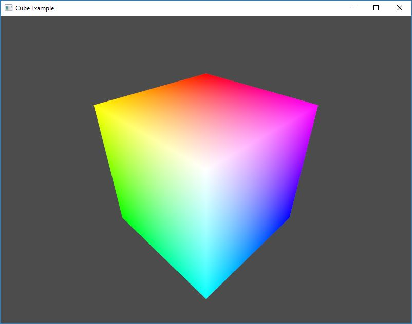
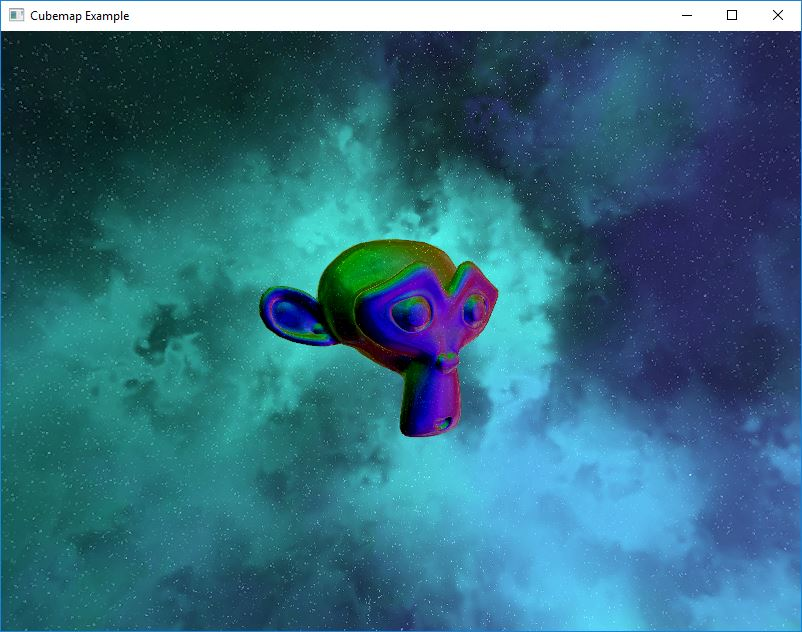
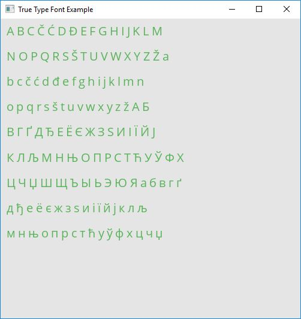
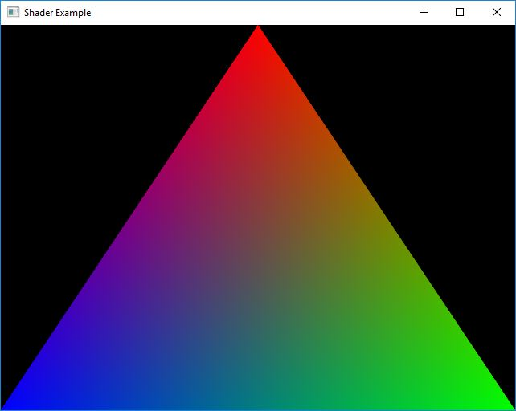

# FineGraphics


## Introduction 

The FineGraphics library is part of a FineFramework project. This standalone library provides the basic API wrappers around OpenGL, such as textures, framebuffers, renderbuffers. This library also provides window management and user input handling in an easy to follow wrapper class using GLFW. For the 2D drawing, a nanovg is used as the backend. This library does not hold your hand, nor does it forces you to design your application in one specific way. For example, if you choose not to use the GLRenderWindow class (which uses GLFW) you are free to use any other OpenGL context providing library and use any other provided OpenGL wrappers in FineGraphics.

**API Documentation is provided at <http://matusnovak.github.io/finegraphics/>**

## Features

* OpenGL wrappers (GLTexture2D, GLTexture2DMS, GLTexture2DArray, GLTexture3D, GLShader, GLProgram, ...)
* OpenGL Core extensions loading (which are globally accessible)
* Window handling using GLFW (an abstract class is provided to include additional backends)
* Matrices: 3x3 and 4x4
* Vector algebra: 2D, 3D, and 4D vectors including Quaternion
* 2D Canvas using nanovg

## Dependencies

All dependencies listed here are already included as a git submodule and will be statically linked to the fineframework library. Therefore, no need to compile them manually, not link them manually! Everything is automated via CMake.

* [freetype2](https://www.freetype.org/)
* [glfw](https://www.glfw.org/)

## TODO

* More examples, documentation, and tutorials
* More unit tests
* Vulkan (maybe)

## Quick example

Create a rendering window and draw a rectangle:

```c++
#include <ffw/graphics.h>
#include <iostream>

class App : public ffw::GLRenderWindow {
public:
    App(const ffw::RenderWindowArgs& args):GLRenderWindow(args, nullptr) {
        canvas = ffw::GLCanvas(ffw::GLCanvas::Settings());
        glClearColor(0.0f, 0.0f, 0.0f, 1.0f);
    }
    ~App() {
    }
    void render() override {
        glClear(GL_COLOR_BUFFER_BIT | GL_DEPTH_BUFFER_BIT);
        canvas.beginFrame(this->getSize());
        canvas.beginPath();
        canvas.roundedRect(
            ffw::Vec2f(10.0f, 10.0f), // pos
            ffw::Vec2f(100.0f, 50.0f), // size
            10.0f // roundness
        );
        canvas.fillColor(ffw::hsv(0.0f, 0.7f, 0.8f, 1.0f));
        canvas.fill();
        canvas.strokeWidth(10.0f);
        canvas.strokeColor(ffw::hsv(0.7f, 0.5f, 0.5f, 0.5f));
        canvas.stroke();
        canvas.endFrame();
    }
    void windowCloseEvent() override {
        this->shouldClose(true);
    }
private:
    ffw::GLCanvas canvas;
};

int main(int argc, char *argv[]) {
    ffw::RenderWindowArgs args;
    args.size = ffw::Vec2i(400, 400);
    args.title = "Example";
    args.samples = 4;
    try {
        App app(args);
        while (app.shouldRender()) {
            app.renderFrame();
            app.poolEvents();
        }
        return EXIT_SUCCESS;
    } catch (std::exception& e) {
        std::cerr << e.what() << std::endl;
        return EXIT_FAILURE;
    }
}
```

## Requirements

One of the following compilers:

* (Windows) Visual Studio 2013 32-bit or 64-bit
* (Windows) Visual Studio 2015 32-bit or 64-bit
* (Windows) Visual Studio 2017 32-bit or 64-bit
* (Windows) MinGW-w64 i686
* (Windows) MinGW-w64 x86_64
* (Linux) GCC 4.9 or newer
* (OSX) Clang 3.7 or newer

## Compiling

You can compile the FineGraphics from the source code (see below), or [use one of the automatically built releases from GitHub Releases](https://github.com/matusnovak/finegraphics/releases).

**Compiling from source code**

```bash
# Clone the repository
git clone https://github.com/matusnovak/finegraphics
cd finegraphics

# Download the dependencies
git submodule init
git submodule update

# Create build folder and run cmake
mkdir build
cd build

# You can replace the "Visual Studio 15 2017" 
# with "Unix Makefiles" on Linux or OSX
cmake .. -G "Visual Studio 15 2017" -DCMAKE_INSTALL_PREFIX=C:/...

# Build using cmake (or open it in Visual Studio IDE)
cmake --build . --target BUILD_ALL --config MinSizeRel

# Optionally run the INSTALL
cmake --build . --target INSTALL --config MinSizeRel
```

## Using FineGraphics

First, compile the library (see section above).

To use the finegraphics in your project, simply include the `C:/path/to/finegraphics/include` and link the `finegraphics.lib` (or `finegraphics.a` on Linux/OSX). 

Go through the examples provided (see examples folder), or read the docummentation at <http://matusnovak.github.io/finegraphics/>

## Examples

All examples are located in the examples folder.

### Clock

[Simple analog clock using the 2D canvas API.](https://github.com/matusnovak/finegraphics/examples/clock.cpp)


### Cube

[Allocate a vertex buffer and create a shader program to render cube](https://github.com/matusnovak/finegraphics/examples/cube.cpp)



### CubeMap

[Load a cubemap from a raw pixels and allocate GLTextureCubemap with a shader](https://github.com/matusnovak/finegraphics/examples/cubemap.cpp)



### True Type Font

[Draw text using True Type font](https://github.com/matusnovak/finegraphics/examples/truetypefont.cpp)



### Tree

[Render a binary tree using the Canvas](https://github.com/matusnovak/finegraphics/examples/tree.cpp)


### Empty

[Hello world program using the Canvas](https://github.com/matusnovak/finegraphics/examples/empty.cpp)


### Image

[Load an image into GLTexture2D and render it using the Canvas](examples/image.cpp)


### Shader

[Compile and use a simple hello world shader program](https://github.com/matusnovak/finegraphics/examples/shader.cpp)



## Alternatives

Looking for alternative library or framework? Try OpenFrameworks, SFML, or Cinder (be warned, they are much more bigger, but feature rich).

## Contributing

Feel free to post a question in GitHub issues. Pull requests are welcome! 

## Contact

Feel free to contact me on my email (see my GitHub profile).

## License

<https://en.wikipedia.org/wiki/MIT_License>

```
The MIT License (MIT)

Copyright (c) 2018 Matus Novak

Permission is hereby granted, free of charge, to any person obtaining a copy
of this software and associated documentation files (the "Software"), to deal
in the Software without restriction, including without limitation the rights
to use, copy, modify, merge, publish, distribute, sublicense, and/or sell
copies of the Software, and to permit persons to whom the Software is
furnished to do so, subject to the following conditions:

The above copyright notice and this permission notice shall be included in all
copies or substantial portions of the Software.

THE SOFTWARE IS PROVIDED "AS IS", WITHOUT WARRANTY OF ANY KIND, EXPRESS OR
IMPLIED, INCLUDING BUT NOT LIMITED TO THE WARRANTIES OF MERCHANTABILITY,
FITNESS FOR A PARTICULAR PURPOSE AND NONINFRINGEMENT. IN NO EVENT SHALL THE
AUTHORS OR COPYRIGHT HOLDERS BE LIABLE FOR ANY CLAIM, DAMAGES OR OTHER
LIABILITY, WHETHER IN AN ACTION OF CONTRACT, TORT OR OTHERWISE, ARISING FROM,
OUT OF OR IN CONNECTION WITH THE SOFTWARE OR THE USE OR OTHER DEALINGS IN THE
SOFTWARE.
```