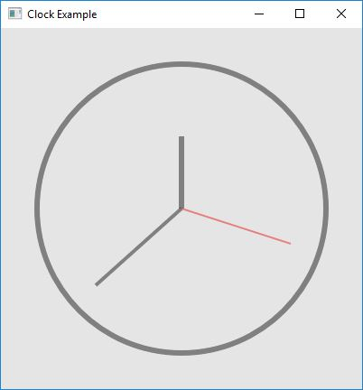
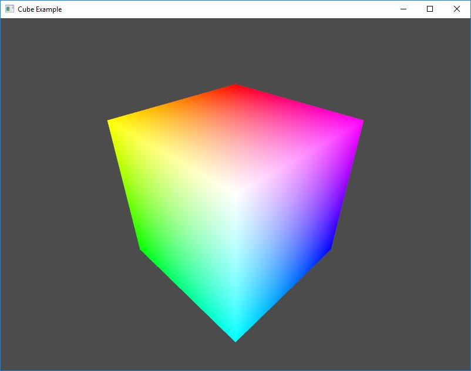
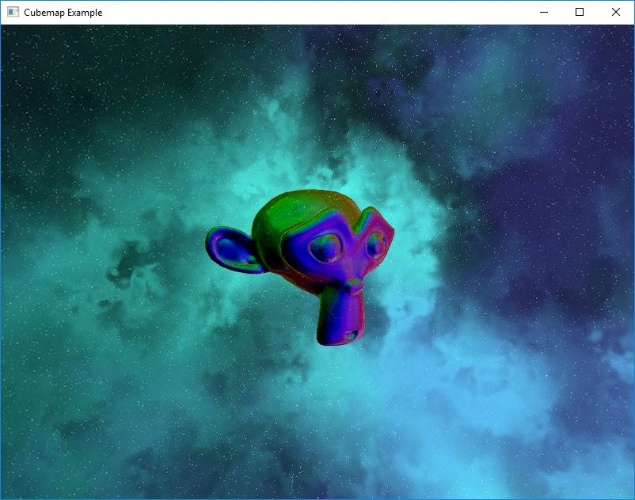
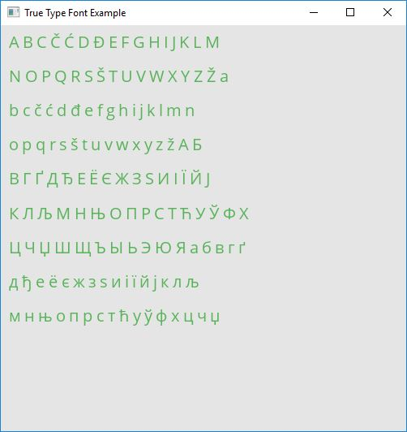
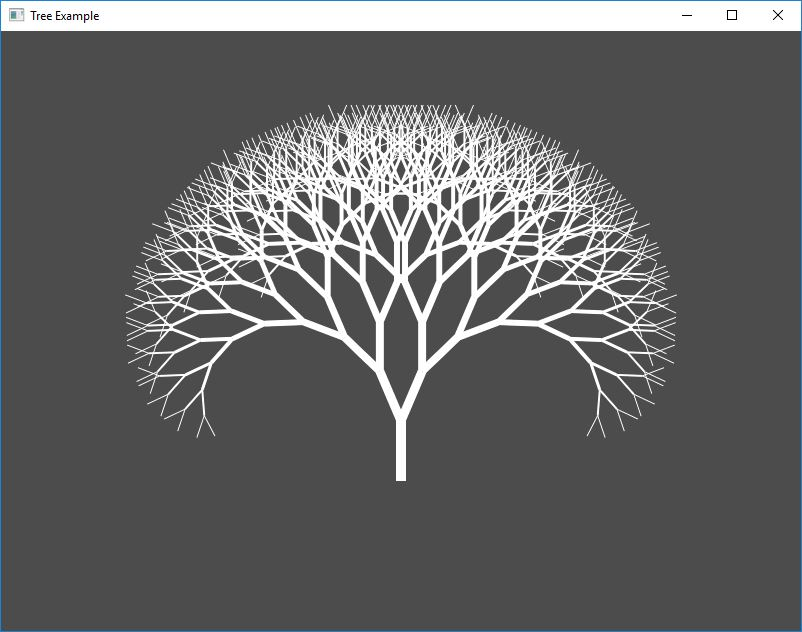
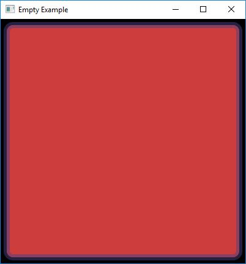
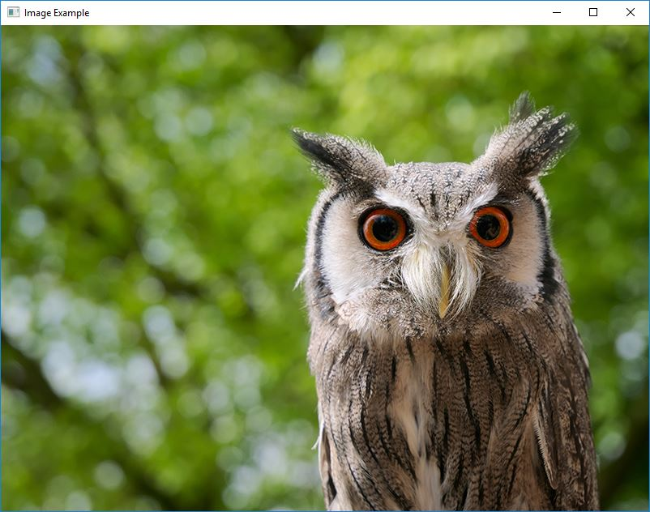
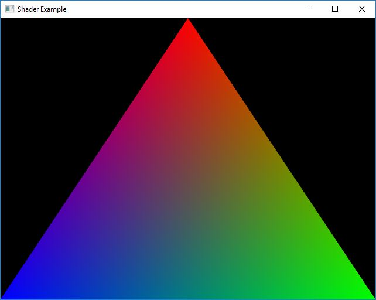

# Examples

The following are examples from <https://github.com/matusnovak/finegraphics/blob/master/examples>.

## Clock

[Simple analog clock using the 2D canvas API.](https://github.com/matusnovak/finegraphics/blob/master/examples/clock.cpp)

## Cube

[Allocate a vertex buffer and create a shader program to render cube](https://github.com/matusnovak/finegraphics/blob/master/examples/cube.cpp)

## CubeMap

[Load a cubemap from a raw pixels and allocate GLTextureCubemap with a shader](https://github.com/matusnovak/finegraphics/blob/master/examples/cubemap.cpp)

## True Type Font

[Draw text using True Type font](https://github.com/matusnovak/finegraphics/blob/master/examples/truetypefont.cpp)

## Tree

[Render a binary tree using the Canvas](https://github.com/matusnovak/finegraphics/blob/master/examples/tree.cpp)

## Empty

[Hello world program using the Canvas](https://github.com/matusnovak/finegraphics/blob/master/examples/empty.cpp)

## Image

[Load an image into GLTexture2D and render it using the Canvas](https://github.com/matusnovak/finegraphics/blob/master/examples/image.cpp)

## Shader

[Compile and use a simple hello world shader program](https://github.com/matusnovak/finegraphics/blob/master/examples/shader.cpp)

